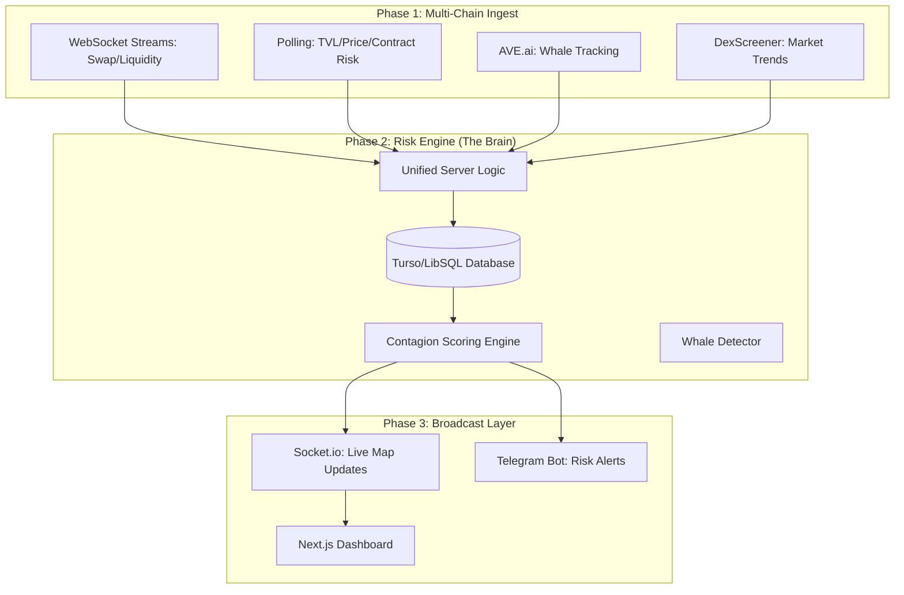

# 👁️ ARGUS — DeFi Contagion Shield
> **Autonomous Risk Sentinel for the DeFi Dark Forest.**

ARGUS is a high-performance intelligence platform designed to detect and broadcast real-time risk signals across systemically important DeFi protocols. By unifying on-chain forensics with public market trends, ARGUS provides a "Contagion Shield" that alerts users before a crisis becomes a collapse.

---

## 🌪️ The Problem: The Speed of Contagion
DeFi risk is viral. When a major pool loses liquidity or a stablecoin slips its peg, the contagion spreads across chains in seconds.
- **Retail Lag**: Users typically find out about risks on social media *after* the liquidity has already been drained.
- **Data Fragmentation**: Intelligence is scattered across multiple explorers, APIs, and chain-specific tools.
- **The "Dark Forest"**: Strategic exits by "Canary Wallets" (whales) are often the first sign of trouble, but they are invisible to the average user.

**ARGUS solves this by providing a unified, real-time risk score for high-TVL protocols.**

---

## 🏗️ System Architecture

The following diagram illustrates the unified data flow from on-chain events to the end-user dashboard and Telegram bot.



---

## 🛡️ Core Intelligence Modules

### 1. Contagion Scoring Engine
Every protocol is assigned a live **Score (0-100)** based on weighted risk parameters:
| Signal | Weight | Logic |
| :--- | :--- | :--- |
| **TVL Velocity** | 25% | Sudden drop in Total Value Locked |
| **LP Drain Rate** | 25% | Aggregated net liquidity outflow |
| **Stablecoin Depeg**| 20% | Price deviation from $1.00 parity |
| **Smart Money Exit**| 20% | Whale/Canary wallet exit movements |
| **AVE Contract Risk**| 10% | Real-time smart contract health check |

### 2. Live Market Intelligence
Integrated with the **DexScreener API**, ARGUS displays real-time market momentum to provide a "Real Life" feel to the dashboard:
- **24H Volume**: Identifying wash trading or organic interest.
- **USD Liquidity**: Accurate, cross-verified TVL numbers.
- **Price Action**: Immediate feedback on market sentiment.

### 3. Telegram Sentinel
A broadcast-only alert system designed for zero-friction intelligence.
- **Subscription**: Simple `/start` model—no login required.
- **Alert Levels**: Instant broadcasts for `ORANGE` and `RED` risk escalations.
- **Status On-Demand**: `/status` provides a quick snapshot of all monitored protocols.

---

## 💻 Tech Stack

### Backend (The Sentinel)
- **Runtime**: Node.js (ES Modules)
- **Framework**: Express + Socket.io
- **Persistence**: Turso / LibSQL (Cloud-edge SQLite)
- **Analytics**: Custom-built Risk Scoring Engine
- **Alerting**: node-telegram-bot-api

### Frontend (The Dashboard)
- **Framework**: Next.js 14
- **Styling**: Vanilla CSS (Tailored Dark Intelligence Aesthetics)
- **Visuals**: Recharts (Risk History & Sparklines)
- **Interactivity**: Tailwind-enhanced interactions and micro-animations

---

## 🛠️ Installation & Setup

### 1. Prerequisites
- Node.js (v18+)
- Turso Database Instance
- Telegram Bot Token (via BotFather)

### 2. Environment Setup
Create a `.env` in the `backend/` directory:
```env
PORT=3001
TURSO_DATABASE_URL=libsql://...
TURSO_AUTH_TOKEN=...
TELEGRAM_BOT_TOKEN=...
AVE_API_TOKEN=...
PHASE1_API_URL=http://localhost:3001
```

### 3. Run the System
```bash
# 1. Install dependencies
cd backend && npm install
cd ../frontend && npm install

# 2. Start Unified Backend
cd backend && npm start

# 3. Start Dashboard
cd frontend && npm run dev
```

---

## 📜 Strategic Mission
ARGUS is built to be the first line of defense in the DeFi Dark Forest. By providing institutional-grade risk intelligence to every user, we level the playing field and ensure that contagion is detected before it becomes a catastrophe.

**Sentinel status: ACTIVE. Monitoring global liquidity.**
